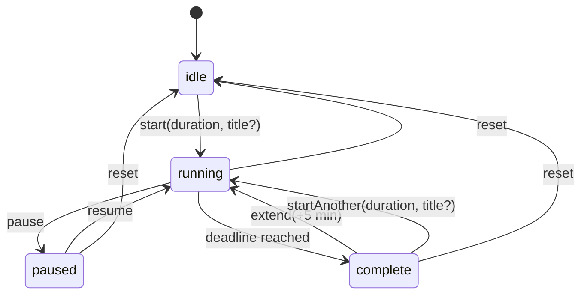

# Cadence — Data Model & Flows

Design reference for the state that drives all four surfaces (menu bar status item,
dropdown, timer window, widgets) and the flows that move between them.

Derived from the user stories in `Cadence — Interfaces & User Stories`.

- [1. Principles](#1-principles)
- [2. Processes and who owns what](#2-processes-and-who-owns-what)
- [3. Data model](#3-data-model)
- [4. Storage layout](#4-storage-layout)
- [5. Derived values (never stored)](#5-derived-values-never-stored)
- [6. State machine](#6-state-machine)
- [7. Flows](#7-flows)
- [8. Surface projections](#8-surface-projections)
- [9. Widget behaviour when the app is not running](#9-widget-behaviour-when-the-app-is-not-running)
- [10. Story traceability](#10-story-traceability)

---

## 1. Principles

**P1 — Store a deadline, never a counter.**
A running session is `endsAt: Date`. Remaining time is always *derived* as
`endsAt − now`. Nothing decrements a stored number on a tick. This is what lets
four surfaces agree without syncing: they each compute from the same deadline.
It also means SwiftUI renders the countdown itself (`Text(timerInterval:)`,
`TimelineView`) with no ticker.

**P2 — One source of truth, on disk, in the App Group.**
The App Group container is canonical. The app holds an in-memory cache
(`SessionController`) that **writes through** on every mutation and **reconciles**
when something else writes. The widget reads the same container.

**P3 — Plan is separate from run.**
`plannedDuration` and `title` describe *what the session is*; `startedAt` /
`endsAt` / `remaining` describe *how this run is going*. Reset clears the run and
keeps the plan — which is exactly the story "reset … get the clock back to its
full duration" while "the stored title survives … reset".

**P4 — Capture at start, not at render.**
A meeting-linked session copies the event's title and the buffer-adjusted deadline
**at the moment Start is pressed**. It does not keep a live pointer to the event.
This is what makes "dismiss the suggested event before starting → the timer is not
named after it" fall out for free, and stops a calendar refresh from mutating a
running session.

**P5 — Presentation fallbacks are not data.**
"25 minute session" is rendered when `title == nil`. It is never written to disk.
Storing it would break "no name is stored at all".

**P6 — Only the app schedules; anyone may mutate.**
The widget, Raycast, and App Intents can all write state. Only the app process
owns the completion notification and phase transition. See §2.

---

## 2. Processes and who owns what

```
┌──────────────────────────────┐        ┌──────────────────────────────┐
│ Cadence.app  (one process)   │        │ CadenceWidget.appex          │
│  • menu bar + window scenes  │        │  ephemeral, sandboxed        │
│  • SessionController (cache) │        │  • renders from snapshot     │
│  • EventKit access           │        │  • runs App Intents on tap   │
│  • schedules notifications   │        │  • no EventKit, no scheduling│
└──────────────┬───────────────┘        └───────────────┬──────────────┘
               │ write-through + Darwin ping            │ read / write
               ▼                                        ▼
        ┌────────────────────────────────────────────────────┐
        │  App Group: group.com.alexmathews.cadence          │
        │  sessionState · preferences · dismissedEvents ·    │
        │  calendarSnapshot                                  │
        └────────────────────────────────────────────────────┘
```

| Concern | Owner | Why |
|---|---|---|
| EventKit queries | **App only** | The appex would need its own TCC grant and it is too slow for a timeline. The app writes a `calendarSnapshot` the widget reads. |
| Completion notification | **App only** | Notification authority lives in the app bundle, not the extension. |
| Phase transition at deadline | **App only** | Single scheduler avoids duplicate transitions. |
| Mutating session state | App, widget intents, Raycast/URL, Shortcuts | All go through the same `SessionActions` funnel. |

**Cross-process change signal.** Every write posts a Darwin notification
(`CFNotificationCenterGetDarwinNotifyCenter`, name `com.alexmathews.cadence.stateDidChange`).
The app observes it and re-reads the container. Cross-process `UserDefaults` KVO is
not reliably prompt; the Darwin ping is the explicit wake-up. Writes to session
state also call `WidgetCenter.reloadAllTimelines()` for the other direction.

**Notification durability.** The completion notification is scheduled at *start*
time as a `UNTimeIntervalNotificationTrigger` for `remaining`, and cancelled on
pause / reset / early completion. It therefore fires even if the app is killed
mid-session. The in-app `Timer` at `endsAt` handles the *state transition* only.

---

## 3. Data model

### 3.1 SessionState

The single record describing the current session. One instance; there is no history.

```swift
enum SessionStatus: String, Codable, Sendable {
    case idle, running, paused, complete
}

struct SessionState: Codable, Equatable, Sendable {
    var status: SessionStatus = .idle

    // ── Plan: survives pause / resume / reset. Replaced only by a new start.
    var plannedDuration: TimeInterval = 25 * 60
    var title: String?                    // nil ⇒ plain duration session (P5)
    var linkedEventKey: String?           // provenance only; not a live pointer

    // ── Run
    var startedAt: Date?                  // first start of this run (span display)
    var endsAt: Date?                     // running only
    var remaining: TimeInterval?          // paused only (frozen)
    var completedAt: Date?                // complete only

    // ── Focus accounting (see §5)
    var focusedBefore: TimeInterval = 0   // sum of finished running segments
    var segmentStartedAt: Date?           // start of the current running segment
}
```

**Invariants by status.** Anything not listed is `nil` / zero.

| status | plannedDuration | title | startedAt | endsAt | remaining | segmentStartedAt | completedAt |
|---|---|---|---|---|---|---|---|
| `idle` | set | may persist | nil | nil | nil | nil | nil |
| `running` | set | may be set | set | **set** | nil | **set** | nil |
| `paused` | set | may be set | set | nil | **set** | nil | nil |
| `complete` | set | may be set | set | nil | nil | nil | **set** |

Note `idle` retains `plannedDuration` **and** `title` after a reset (P3), so the
window still shows the full duration on the numerals and the name is not lost.

### 3.2 Preferences

```swift
struct Preferences: Codable, Equatable, Sendable {
    /// 0 = off. Story offers off / 1m / 2m / 3m.
    var endEarlyBuffer: TimeInterval = 120
    /// Last duration the user chose, so idle shows something sensible.
    var lastUsedDuration: TimeInterval = 25 * 60
}
```

The buffer is a **preference, not a session field**. It is *materialised* into
`endsAt` at start time (P4). That satisfies "a meeting timer started from the
dropdown, a widget, or after a relaunch still ends early by the amount I set" —
every surface reads the same preference before computing the deadline.

Changing the buffer mid-session does **not** retime a running session.

### 3.3 Calendar

```swift
struct EventOccurrence: Codable, Equatable, Sendable, Identifiable {
    /// "\(eventIdentifier)|\(Int(startsAt.timeIntervalSince1970))"
    var id: String
    var title: String
    var startsAt: Date
    var endsAt: Date
}

enum CalendarAccess: String, Codable, Sendable {
    case notDetermined, denied, authorized
}

struct CalendarSnapshot: Codable, Equatable, Sendable {
    var day: Date                     // startOfDay the snapshot covers
    var events: [EventOccurrence]     // sorted by startsAt; all-day excluded
    var lastSyncedAt: Date
    var access: CalendarAccess = .notDetermined
}
```

**All-day events are excluded** at fetch time and never enter the model — there is
no meaningful instant to time a session against. They are therefore absent from the
strip, the suggestion rows, and `suggestedEvent`.

Keep the snapshot **deliberately minimal — title, start, end, key and nothing
else.** Copying calendar data out of EventKit moves it out from behind the TCC
permission gate into a plaintext plist in the user's container, so it should carry
the least data that satisfies the stories. No notes, attendees, locations, or URLs.
Clear the snapshot if calendar access is revoked.

**On the identifier.** `EKEvent.eventIdentifier` is **shared by every occurrence
of a recurring event** — today's standup and tomorrow's standup have the same
value — and Apple does not guarantee it is stable across edits/sync. So the key is
composite: `eventIdentifier | occurrence start epoch`. When you fetch with
`predicateForEvents(withStart:end:calendars:)` EventKit expands recurrences into
one `EKEvent` per occurrence, each carrying its own `startDate`, so the composite
is well-defined and unique per instance. The stability caveats do not bite because
dismissal state is day-scoped and disposable.

### 3.4 Dismissals

```swift
/// Set of EventOccurrence.id the user has dismissed. Day-scoped.
typealias DismissedEventKeys = Set<String>
```

Stored as `[String]` in the App Group. **Pruned on every read and write**: any key
whose embedded occurrence timestamp is before `startOfDay(now)` is dropped. This
caps growth and makes dismissals expire at midnight with no scheduled job.

Dismissal is app state — never write it back to `EKEvent`; the user's calendar is
not ours to mutate.

---

## 4. Storage layout

All in `UserDefaults(suiteName: "group.com.alexmathews.cadence")`, which resolves
to `~/Library/Group Containers/group.com.alexmathews.cadence/Library/Preferences/`.
Values are JSON-encoded `Data` (except the dismissal array).

| Key | Type | Written by | Read by | Survives relaunch |
|---|---|---|---|---|
| `sessionState` | `SessionState` JSON | app, widget intents, URL/Raycast | all surfaces | yes, but reconciled (§7.M) |
| `preferences` | `Preferences` JSON | app (window buffer chips) | all surfaces | **yes — required** |
| `dismissedEventKeys` | `[String]` | app (window strip) | app, widget | yes, pruned to today |
| `calendarSnapshot` | `CalendarSnapshot` JSON | **app only** | app, widget | yes, refreshed on read if stale |

**There is no session history.** Cadence stores exactly one session — the current
one. A completed session is overwritten by the next `start`. Nothing accumulates,
so no store needs to grow, and the summary on the complete state is the only
retrospective view in the product.

**Why `UserDefaults` and not SQLite/SwiftData.** Every item above is a single small
record or a short string set — no queries, no growth, no relations. `cfprefsd`
already mediates the cross-process access we need. A database would add schema and
migration cost for nothing, and opening one inside the constantly-relaunched widget
process is a known source of lock/migration pain. With history explicitly out of
scope, that calculus does not change.

---

## 5. Derived values (never stored)

Computed on read from `SessionState` + `now`. Storing any of these would create a
second source of truth that can disagree with the deadline.

| Derived | Definition |
|---|---|
| `effectiveStatus(now)` | `status == .running && endsAt <= now ? .complete : status`. Every surface derives status this way rather than trusting the stored value, so a session that elapsed while nothing was there to transition it still *reads* as complete. |
| `isSnapshotFresh(now)` | `snapshot.day == startOfDay(now)` — false means show the empty/refresh strip, never yesterday's meetings |
| `remaining(now)` | `running`: `max(0, endsAt − now)` · `paused`: `remaining` · `idle`: `plannedDuration` · `complete`: `0` |
| `focused(now)` | `focusedBefore + (segmentStartedAt.map { now − $0 } ?? 0)`, capped at `plannedDuration` |
| `progress(now)` | `1 − remaining(now) / plannedDuration`, clamped to `0…1` — freezes while paused |
| `displayName` | `title ?? "\(Int(plannedDuration/60)) minute session"` — **presentation only** (P5) |
| `span` | `startedAt…completedAt`, e.g. `1:48–2:13 PM` |
| `summaryLine` | `"\(span) · \(Int(focused/60)) min focused"` |
| `suggestedEvent` | first `snapshot.events` where `id ∉ dismissed` and `startsAt − buffer > now + 1 min` |
| `clockTargets` | next two :00/:30 boundaries after `now + 5 min`, as `("To 2:30", minutes)` |
| `canStartMeetingTimer` | `status == .idle && suggestedEvent != nil` |

`focused` is tracked separately from the span because pauses make them differ: a
session started 1:48, paused 5 minutes, finishing 2:18 shows a 1:48–2:18 span but
25 min focused. The summary story asks for both numbers, so both must be right.

---

## 6. State machine



**Transition rules**

| Transition | Effect |
|---|---|
| `start(duration, title)` | Replaces the plan. `plannedDuration = duration`, `title = title` (nil for plain duration), `startedAt = now`, `endsAt = now + duration`, `segmentStartedAt = now`, `focusedBefore = 0`. Schedules the completion notification. |
| `pause` | `remaining = endsAt − now`, `focusedBefore += now − segmentStartedAt`, clears `endsAt`/`segmentStartedAt`. Cancels the notification. |
| `resume` | `endsAt = now + remaining`, `segmentStartedAt = now`, clears `remaining`. Reschedules the notification. |
| `reset` | Clears **run** fields and focus accounting → `idle`. **Keeps `plannedDuration` and `title`.** Cancels the notification. |
| `complete` | `completedAt = endsAt`, `focusedBefore += endsAt − segmentStartedAt`, clears run fields. Notification already delivered. |
| `extend(5m)` | `endsAt = max(now, completedAt) + 5 min`, `plannedDuration += 5 min`, `segmentStartedAt = now`, `completedAt = nil` → `running`. Keeps `title`. |
| `startAnother` | Identical to `start` — a full plan replacement, including `title` (nil unless a new event is chosen). |

`extend` uses `max(now, completedAt)` deliberately: returning to a session that
finished ten minutes ago should give five more minutes *from now*, not a deadline
already in the past.

**Complete is terminal until the user acts.** There is no auto-expiry: the menu bar
holds the mint `00:00` and the summary stays on the window/widget indefinitely,
until `extend`, `startAnother`, or `reset`. This is deliberate — a finished session
is a thing to acknowledge, not to let evaporate. Widget timeline policy for
`complete` is therefore `.never`.

**Guards** (these are the "cannot accidentally" stories)

- `extend` is offered **only** in `complete`.
- `start` / "Timer until…" / suggestion rows are offered **only** in `idle`
  (and `complete`, as "Start another"), never while `running` or `paused`.
- Quick durations are hidden once `status != .idle`.
- The **editable numerals are `idle`-only**. Typing a duration while `paused` is not
  permitted: the plan would change under a frozen `remaining`, leaving progress and
  the resume deadline ambiguous. To re-scope a paused session, `reset` then start.

---

## 7. Flows

### A. Start from a duration preset (45 min)
1. Surface calls `SessionActions.start(duration: 45m, title: nil)`.
2. Controller applies the `start` transition, writes `sessionState`, posts the
   Darwin ping, reloads widget timelines, schedules the notification.
3. All surfaces recompute from `endsAt`. No name is stored; they render
   "45 minute session" (P5).

### B. Start from a clock target ("To 2:30")
1. Surface derives `duration = target − now` (already shown as minutes next to the
   label) and calls the same `start(duration:title:nil)`.
2. Identical to A. **The buffer is not applied** — a clock target is an explicit
   end time, not a meeting.

### C. Start from a calendar event ("To Design review")
1. Read `preferences.endEarlyBuffer`.
2. `deadline = event.startsAt − buffer`; `duration = deadline − now`.
   If `duration <= 0` the row is not offered.
3. `start(duration:, title: event.title, linkedEventKey: event.id)` — the title is
   **copied**, not referenced (P4).
4. Thereafter the session is independent: dismissing or refreshing the event does
   not rename or retime it.

### D. Pause / resume
Pause freezes `remaining` and banks the segment into `focusedBefore`; resume
recomputes `endsAt` from `now`. Progress does not jump because it is derived from
`remaining`, which is frozen. Title untouched.

### E. Reset
Run fields cleared, `status = idle`, notification cancelled. `plannedDuration` and
`title` deliberately survive, so the numerals return to the full duration and the
session keeps its name until a *different* session is started.

### F. Completion
1. The scheduled `UNTimeIntervalNotificationTrigger` fires — independent of app
   liveness.
2. The app's one-shot `Timer` at `endsAt` applies the `complete` transition, writes
   state, pings, reloads widgets.
3. Menu bar goes mint with `00:00`; window and medium widget show
   `summaryLine`; `title` remains on the summary.
4. If the app was not running, the notification still arrived and the stale
   `endsAt` is reconciled at next launch (M).

### G. +5 min, H. Start another
`extend` and `startAnother` per §6. Both are reachable from dropdown, window, and
widget; all three call the same funnel.

### I. Dismiss an event
1. Insert `event.id` into `dismissedEventKeys`, prune, write, reload widgets.
2. `suggestedEvent` recomputes; the next event slides into the strip. Because the
   strip renders a fixed-height row bound to a derived optional, the layout does
   not jump.
3. A dismissal never affects a session already started from that event (P4).

### J. Calendar refresh
1. App requests EventKit access if `notDetermined` (`requestFullAccessToEvents`,
   `NSCalendarsUsageDescription` required).
2. Fetch today's events via `predicateForEvents(withStart:end:calendars:)` —
   recurrences arrive pre-expanded per occurrence.
3. Map to `EventOccurrence`, **excluding all-day events** (they carry no meaningful
   start to time against), sort by `startsAt`, write `calendarSnapshot` with
   `lastSyncedAt` (surfaced as "last synced" in the strip), reload widgets.
4. Also triggered on `EKEventStoreChanged`, on wake, and on day rollover.
5. **A refresh never clears dismissals.** Dismissal is a deliberate user judgement
   about an occurrence; re-syncing the calendar is not a signal to revisit it. The
   set is keyed by occurrence (§3.3), so a refreshed event keeps its dismissed
   state, and dismissals expire on their own at day rollover.

### K. Change the end-early buffer
Write `preferences`. Reload widgets so their meeting rows re-derive. Running
sessions are not retimed (§3.2).

### L. Mutation from widget / Raycast / Shortcuts
1. Intent or URL handler performs read-modify-write on `sessionState` and posts the
   Darwin ping.
2. The app receives the ping, reloads its cache, and **re-arms** the transition
   timer and notification to match the new deadline.
3. Last-write-wins; writes replace the whole blob. Two writers racing within the
   same instant is accepted as a non-issue for a single-user app.

### M. Launch / wake reconciliation
On `SessionController.init` and on wake:
- `running` with `endsAt <= now` → apply `complete` (the notification already fired).
- `running` with `endsAt > now` → re-arm timer and notification.
- `paused` → nothing to schedule.
- `calendarSnapshot.day != startOfDay(now)` → refresh (J) and prune dismissals.

This is the only "persistence" logic the timer needs — the session is not meant to
survive a restart as a *running* session, it is meant to resolve honestly.

---

## 8. Surface projections

All four surfaces render the same derived values; they differ only in which
controls they expose.

| Surface | Reads | Renders |
|---|---|---|
| Status item | `status`, `remaining` | idle: mark · running: blue + `mm:ss` · complete: mint + `00:00` |
| Dropdown | + `displayName`, `suggestedEvent`, `clockTargets` | presets, primary/secondary actions, summary line |
| Window | + `progress`, `span`, `focused`, snapshot, `preferences` | numerals (editable when idle), progress rule, buffer chips, full-day strip |
| Widget S | `status`, `remaining`, `displayName` | one tile |
| Widget M | + `suggestedEvent`, `summaryLine` | tile + context pane; suggestions hidden unless idle |

**Widget timeline policy** — `running`: single entry with
`Text(timerInterval:countsDown:)` and `.after(endsAt)`. `paused` / `idle` /
`complete`: single entry, `.never` (state only changes via a write, which triggers
an explicit reload).

**Status → colour token**, so all surfaces agree: `idle` → foreground/secondary ·
`running` → electric blue `#2F6BFF` · `complete` → mint `#2FE0A6` · calendar
affordances → orange `#FF8A3D` · background navy `#0b1024`.

---

## 9. Widget behaviour when the app is not running

The widget extension is a **separate process** owned by `chronod`, not by
Cadence.app. It reads the App Group container directly, so most of it keeps
working with the app dead. Cadence is a login item (`SMAppService.mainApp`), so
this is an edge case — but it must degrade honestly, not lie.

| Capability | App dead | Why |
|---|---|---|
| Render current state | ✅ works | appex reads the App Group container; no app needed |
| Live countdown ticking | ✅ works | `Text(timerInterval:countsDown:)` is rendered by WidgetKit from the cached entry — no process ticks it |
| Roll over to complete at `endsAt` | ✅ works *visually* | `.after(endsAt)` respawns the appex; `effectiveStatus` derives complete from the elapsed deadline (§5) |
| Buttons: start / pause / reset / +5 | ✅ works | the intent runs **in the appex**, read-modify-writes the container, WidgetKit reloads |
| Completion **notification** | ⚠️ only if the app scheduled it | see below |
| Calendar suggestions | ⚠️ snapshot only, may be stale | appex has no EventKit access; falls back to the empty strip when `isSnapshotFresh` is false |
| Calendar refresh | ❌ unavailable | app-only (§2) |
| Persisting `status = .complete` | ❌ not written | see below |

**The stored status goes stale, and that is fine.** No process transitions
`running → complete` while the app is dead, so `sessionState.status` stays
`running` with a past `endsAt`. Two rules absorb this:

1. Surfaces render `effectiveStatus(now)`, never the raw field (§5).
2. The app reconciles the record at next launch/wake (§7.M).

The timeline provider deliberately does **not** write the transition. Writing from
`getTimeline` is racy (chronod may call it speculatively, more than once) and would
put a second scheduler in the system, violating P6.

**Notifications are the one real gap.** The completion notification is scheduled at
*start* time as a `UNTimeIntervalNotificationTrigger`, so it fires even if the app
is killed mid-session (§2). But a session **started from the widget while the app
is dead** has nobody to schedule it — notification authorization belongs to the app
bundle, and the appex is not a reliable place to register one. Consequences:

- Widget-started session, app alive (normal case): app receives the Darwin ping,
  schedules the notification. ✅
- Widget-started session, app dead: the timer is correct everywhere and the widget
  will show complete, but **no banner fires**. On next launch the app reconciles and
  posts nothing retroactively.

Mitigation, in preference order: (a) rely on the login item so the app is
effectively always running; (b) have the app, on launch, ensure a notification
exists for any still-running session; (c) if this proves user-visible, set
`openAppWhenRun = true` on the session-starting intents only — accepting a
background app launch in exchange for a guaranteed banner.

## 10. Story traceability

The stories with non-obvious modelling consequences:

| Story | Mechanism |
|---|---|
| "stored title survives pause, resume, and reset" | `title` is a **plan** field; `reset` clears only run fields (§6). |
| "only starting a different session replaces it" | `start` / `startAnother` are the only writers of `title`. |
| "dismisses the suggested event before starting → not named after it" | Title is copied at start (P4); `suggestedEvent` is derived, so a dismissed event is simply not the thing passed to `start`. |
| "no name is stored at all … which is presentation" | `title: String?` stays `nil`; `displayName` fallback is computed (P5). |
| "buffer … still ends early after a relaunch / from widget" | Buffer is in `preferences` in the App Group, read by every surface at start time (§3.2). |
| "title shown wherever the session appears — all surfaces agree" | One `SessionState`, one `displayName` derivation (§8). |
| "dismiss … next one takes its place, without the layout jumping" | Dismissal mutates a key set; the strip binds to a derived optional in a fixed-height row (§7.I). |
| "cannot accidentally start a second timer" | Guards on `status` (§6). |
| "span **and** total focused time" | `startedAt`/`completedAt` vs `focusedBefore` accounting (§5). |
| "+5 so a near-finish doesn't force a whole new block" | `extend` keeps plan/title and extends `plannedDuration` (§6). |
| "reset … back to its full duration" | `plannedDuration` survives reset. |

---
