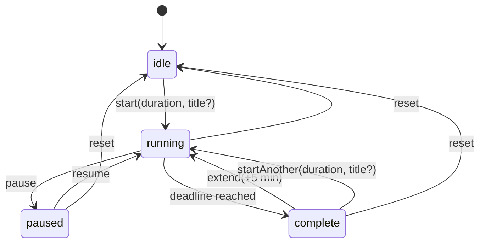

# Cadence — Data Model & State Machine

Design reference for the state that drives all four surfaces (menu bar status item,
dropdown, timer window, widgets).

Derived from the user stories in `Cadence — Interfaces & User Stories`.

Scope: the shape of the data, where it is stored, what is derived rather than
stored, and the legal transitions between session states. Process ownership,
surface projections, and the flows that invoke transitions are out of scope.

- [1. Principles](#1-principles)
- [2. Data model](#2-data-model)
- [3. Storage layout](#3-storage-layout)
- [4. Derived values (never stored)](#4-derived-values-never-stored)
- [5. State machine](#5-state-machine)
- [6. Story traceability](#6-story-traceability)

---

## 1. Principles

**P1 — Store a deadline, never a counter.**
A running session is `endsAt: Date`. Remaining time is always *derived* as
`endsAt − now`. Nothing decrements a stored number on a tick. This is what lets
four surfaces agree without syncing: they each compute from the same deadline.
It also means SwiftUI renders the countdown itself (`Text(timerInterval:)`,
`TimelineView`) with no ticker.

**P2 — One source of truth, on disk, in the App Group.**
The App Group container is canonical. Any in-memory copy is a cache that writes
through on every mutation and re-reads when the container changes underneath it.

**P3 — Plan is separate from run.**
`plannedDuration` and `title` describe *what the session is*; `startedAt` /
`endsAt` / `remaining` describe *how this run is going*. Reset clears the run and
keeps the plan — which is exactly the story "reset … get the clock back to its
full duration" while "the stored title survives … reset".

**P4 — Capture at start, not at render.**
A meeting-linked session copies the event's title and the buffer-adjusted deadline
**at the moment Start is pressed**. It does not keep a live pointer to the event.
This is what makes "dismiss the suggested event before starting → the timer is not
named after it" fall out for free, and stops a calendar refresh from mutating a
running session.

**P5 — Presentation fallbacks are not data.**
"25 minute session" is rendered when `title == nil`. It is never written to disk.
Storing it would break "no name is stored at all".

---

## 2. Data model

### 2.1 SessionState

The single record describing the current session. One instance; there is no history.

```swift
enum SessionStatus: String, Codable, Sendable {
    case idle, running, paused, complete
}

struct SessionState: Codable, Equatable, Sendable {
    var status: SessionStatus = .idle

    // ── Plan: survives pause / resume / reset. Replaced only by a new start.
    var plannedDuration: TimeInterval = 25 * 60
    var title: String?                    // nil ⇒ plain duration session (P5)
    var linkedEventKey: String?           // provenance only; not a live pointer

    // ── Run
    var startedAt: Date?                  // first start of this run (span display)
    var endsAt: Date?                     // running only
    var remaining: TimeInterval?          // paused only (frozen)
    var completedAt: Date?                // complete only

    // ── Focus accounting (see §4)
    var focusedBefore: TimeInterval = 0   // sum of finished running segments
    var segmentStartedAt: Date?           // start of the current running segment
}
```

**Invariants by status.** Anything not listed is `nil` / zero.

| status | plannedDuration | title | startedAt | endsAt | remaining | segmentStartedAt | completedAt |
|---|---|---|---|---|---|---|---|
| `idle` | set | may persist | nil | nil | nil | nil | nil |
| `running` | set | may be set | set | **set** | nil | **set** | nil |
| `paused` | set | may be set | set | nil | **set** | nil | nil |
| `complete` | set | may be set | set | nil | nil | nil | **set** |

Note `idle` retains `plannedDuration` **and** `title` after a reset (P3), so the
full duration is still available for the numerals and the name is not lost.

### 2.2 Preferences

```swift
struct Preferences: Codable, Equatable, Sendable {
    /// 0 = off. Story offers off / 1m / 2m / 3m.
    var endEarlyBuffer: TimeInterval = 120
    /// Last duration the user chose, so idle shows something sensible.
    var lastUsedDuration: TimeInterval = 25 * 60
}
```

The buffer is a **preference, not a session field**. It is *materialised* into
`endsAt` at start time (P4). That satisfies "a meeting timer started from the
dropdown, a widget, or after a relaunch still ends early by the amount I set" —
every surface reads the same preference before computing the deadline.

Changing the buffer mid-session does **not** retime a running session.

### 2.3 Calendar

```swift
struct EventOccurrence: Codable, Equatable, Sendable, Identifiable {
    /// "\(eventIdentifier)|\(Int(startsAt.timeIntervalSince1970))"
    var id: String
    var title: String
    var startsAt: Date
    var endsAt: Date
}

enum CalendarAccess: String, Codable, Sendable {
    case notDetermined, denied, authorized
}

struct CalendarSnapshot: Codable, Equatable, Sendable {
    var day: Date                     // startOfDay the snapshot covers
    var events: [EventOccurrence]     // sorted by startsAt; all-day excluded
    var lastSyncedAt: Date
    var access: CalendarAccess = .notDetermined
}
```

The snapshot exists because only the app can query EventKit; the widget renders
from this record instead. It is therefore **display and identity data, not
authority** — an occurrence key is re-resolved against the live event store before
a meeting-linked deadline is computed.

**All-day events are excluded** and never enter the model — there is no meaningful
instant to time a session against.

Keep the snapshot **deliberately minimal — title, start, end, key and nothing
else.** Copying calendar data out of EventKit moves it out from behind the TCC
permission gate into a plaintext plist in the user's container, so it should carry
the least data that satisfies the stories. No notes, attendees, locations, or URLs.
Clear the snapshot if calendar access is revoked.

**On the identifier.** `EKEvent.eventIdentifier` is **shared by every occurrence
of a recurring event** — today's standup and tomorrow's standup have the same
value — and Apple does not guarantee it is stable across edits/sync. So the key is
composite: `eventIdentifier | occurrence start epoch`. When you fetch with
`predicateForEvents(withStart:end:calendars:)` EventKit expands recurrences into
one `EKEvent` per occurrence, each carrying its own `startDate`, so the composite
is well-defined and unique per instance. The stability caveats do not bite because
dismissal state is day-scoped and disposable.

### 2.4 Dismissals

```swift
/// Set of EventOccurrence.id the user has dismissed. Day-scoped.
typealias DismissedEventKeys = Set<String>
```

Stored as `[String]` in the App Group. **Pruned on every read and write**: any key
whose embedded occurrence timestamp is before `startOfDay(now)` is dropped. This
caps growth and makes dismissals expire at midnight with no scheduled job.

Because the set is keyed by occurrence, re-syncing the calendar preserves
dismissals — a refreshed event keeps its dismissed state, and expiry is handled
entirely by day-scoped pruning.

Dismissal is app state — never write it back to `EKEvent`; the user's calendar is
not ours to mutate.

---

## 3. Storage layout

All in `UserDefaults(suiteName: "group.com.alexmathews.cadence")`, which resolves
to `~/Library/Group Containers/group.com.alexmathews.cadence/Library/Preferences/`.
Values are JSON-encoded `Data` (except the dismissal array).

| Key | Type | Written by | Read by | Survives relaunch |
|---|---|---|---|---|
| `sessionState` | `SessionState` JSON | app, widget intents, URL/Raycast | all surfaces | yes, reconciled on load |
| `preferences` | `Preferences` JSON | app | all surfaces | **yes — required** |
| `dismissedEventKeys` | `[String]` | app | app, widget | yes, pruned to today |
| `calendarSnapshot` | `CalendarSnapshot` JSON | **app only** | app, widget | yes, refreshed when stale |

**There is no session history.** Cadence stores exactly one session — the current
one. A completed session is overwritten by the next `start`. Nothing accumulates,
so no store needs to grow, and the summary on the complete state is the only
retrospective view in the product.

**Why `UserDefaults` and not SQLite/SwiftData.** Every item above is a single small
record or a short string set — no queries, no growth, no relations. `cfprefsd`
already mediates the cross-process access we need. A database would add schema and
migration cost for nothing, and opening one inside the constantly-relaunched widget
process is a known source of lock/migration pain. With history explicitly out of
scope, that calculus does not change.

---

## 4. Derived values (never stored)

Computed on read from `SessionState` + `now`. Storing any of these would create a
second source of truth that can disagree with the deadline.

| Derived | Definition |
|---|---|
| `effectiveStatus(now)` | `status == .running && endsAt <= now ? .complete : status`. Every surface derives status this way rather than trusting the stored value, so a session that elapsed while nothing was there to transition it still *reads* as complete. |
| `isSnapshotFresh(now)` | `snapshot.day == startOfDay(now)` — false means show the empty state, never yesterday's meetings |
| `remaining(now)` | `running`: `max(0, endsAt − now)` · `paused`: `remaining` · `idle`: `plannedDuration` · `complete`: `0` |
| `focused(now)` | `focusedBefore + (segmentStartedAt.map { now − $0 } ?? 0)`, capped at `plannedDuration` |
| `progress(now)` | `1 − remaining(now) / plannedDuration`, clamped to `0…1` — freezes while paused |
| `displayName` | `title ?? "\(Int(plannedDuration/60)) minute session"` — **presentation only** (P5) |
| `span` | `startedAt…completedAt`, e.g. `1:48–2:13 PM` |
| `summaryLine` | `"\(span) · \(Int(focused/60)) min focused"` |
| `suggestedEvent` | first `snapshot.events` where `id ∉ dismissed` and `startsAt − buffer > now + 1 min` |
| `clockTargets` | next two :00/:30 boundaries after `now + 5 min`, as `("To 2:30", minutes)` |
| `canStartMeetingTimer` | `status == .idle && suggestedEvent != nil` |

`focused` is tracked separately from the span because pauses make them differ: a
session started 1:48, paused 5 minutes, finishing 2:18 shows a 1:48–2:18 span but
25 min focused. The summary story asks for both numbers, so both must be right.

---

## 5. State machine



**Transition rules.** Effects on `SessionState` only; side effects such as
notification scheduling and widget reloads are implementation concerns and are not
described here.

| Transition | Effect |
|---|---|
| `start(duration, title)` | Replaces the plan. `plannedDuration = duration`, `title = title` (nil for plain duration), `startedAt = now`, `endsAt = now + duration`, `segmentStartedAt = now`, `focusedBefore = 0`. |
| `pause` | `remaining = endsAt − now`, `focusedBefore += now − segmentStartedAt`, clears `endsAt` / `segmentStartedAt`. |
| `resume` | `endsAt = now + remaining`, `segmentStartedAt = now`, clears `remaining`. |
| `reset` | Clears **run** fields and focus accounting → `idle`. **Keeps `plannedDuration` and `title`.** |
| `complete` | `completedAt = endsAt`, `focusedBefore += endsAt − segmentStartedAt`, clears run fields. |
| `extend(5m)` | `endsAt = max(now, completedAt) + 5 min`, `plannedDuration += 5 min`, `segmentStartedAt = now`, `completedAt = nil` → `running`. Keeps `title`. |
| `startAnother` | Identical to `start` — a full plan replacement, including `title` (nil unless a new event is chosen). |

`extend` uses `max(now, completedAt)` deliberately: returning to a session that
finished ten minutes ago should give five more minutes *from now*, not a deadline
already in the past.

**Complete is terminal until the user acts.** There is no auto-expiry: the complete
state persists indefinitely until `extend`, `startAnother`, or `reset`. A finished
session is a thing to acknowledge, not to let evaporate.

**Reachability.** `idle` is the only initial state. `complete` is reachable solely
by the deadline elapsing — never by a user action — which is why there is no
"finish early" transition; abandoning a session is `reset`.

**Guards** (these are the "cannot accidentally" stories)

- `extend` is legal **only** from `complete`.
- `start` is legal **only** from `idle` and `complete` (as "Start another"), never
  from `running` or `paused`.
- Duration selection — presets and the editable numerals alike — is legal **only**
  in `idle`. Typing a duration while `paused` is not permitted: the plan would
  change under a frozen `remaining`, leaving progress and the resume deadline
  ambiguous. To re-scope a paused session, `reset` then start.

---

## 6. Story traceability

The stories with non-obvious modelling consequences:

| Story | Mechanism |
|---|---|
| "stored title survives pause, resume, and reset" | `title` is a **plan** field; `reset` clears only run fields (§5). |
| "only starting a different session replaces it" | `start` / `startAnother` are the only writers of `title`. |
| "dismisses the suggested event before starting → not named after it" | Title is copied at start (P4); `suggestedEvent` is derived, so a dismissed event is simply not the thing passed to `start`. |
| "no name is stored at all … which is presentation" | `title: String?` stays `nil`; `displayName` fallback is computed (P5). |
| "buffer … still ends early after a relaunch / from widget" | Buffer is in `preferences` in the App Group, read at start time (§2.2). |
| "title shown wherever the session appears — all surfaces agree" | One `SessionState`, one `displayName` derivation (§4). |
| "dismiss … next one takes its place" | `suggestedEvent` is derived over the dismissal set, so removing one promotes the next (§2.4, §4). |
| "cannot accidentally start a second timer" | Guards on `status` (§5). |
| "span **and** total focused time" | `startedAt` / `completedAt` vs `focusedBefore` accounting (§4). |
| "+5 so a near-finish doesn't force a whole new block" | `extend` keeps plan/title and extends `plannedDuration` (§5). |
| "reset … back to its full duration" | `plannedDuration` survives reset. |
| "complete stays until I act on it" | No auto-expiry transition out of `complete` (§5). |
